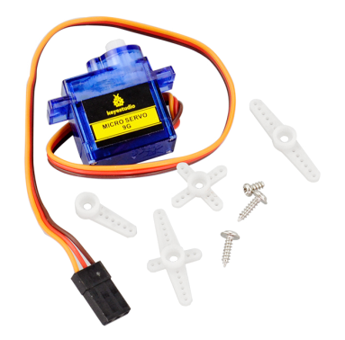
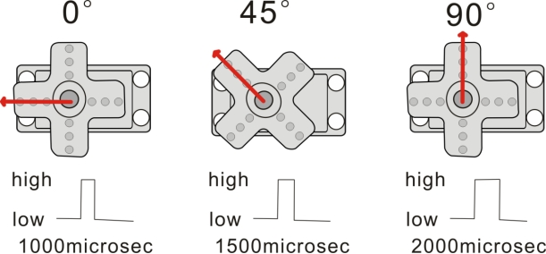
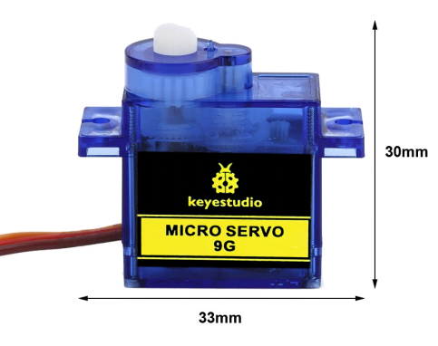
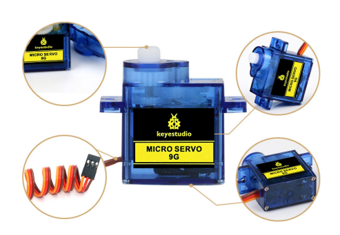
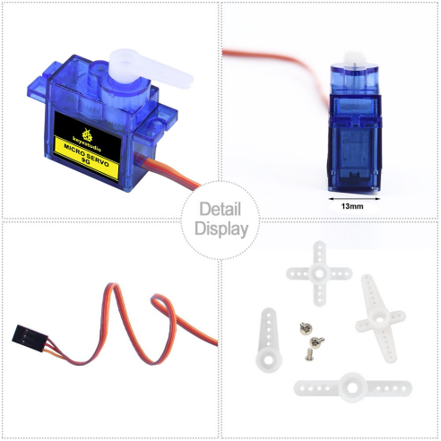
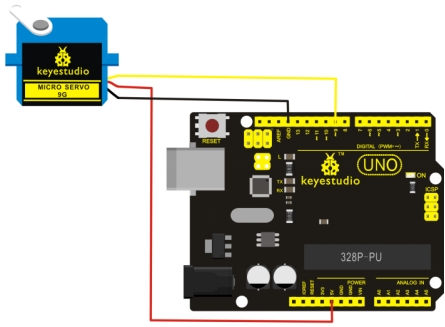
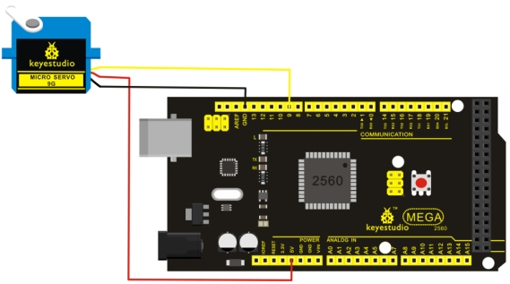

# KS0209 keyestudio 9G Servo Motor Blue 90°



## 1. Introduction

This keyestudio micro servo motor comes with 90 degrees.

Included with your servo motor you will find a variety of white motor mounts that connect to the shaft of your servo. You may choose to attach any mount you wish for the circuit. It will serve as a visual aid, making it easier to see the servo spin.

The servo has three interfaces,distinguished by brown, red and orange line (different brand may have different color). Brown line is for GND, red one for power 5V, orange one for signal terminal (PWM signal).

The rotation angle of servo is controlled by regulating the duty cycle of the PWM(Pulse-Width Modulation) signal. The standard cycle of the PWM signal is fixed at 20ms (50 Hz), and the pulse width is distributed between 1ms-2ms. The pulse width corresponds to the rotation angle ( 0°～90°) of servo.



## 2. Parameters

- Operating voltage: DC 4.8V〜6V
- Angle range: about 90°(in 1000→2000μsec)
- Pulsewidth range: 1000→2000μsec
- No-load speed: 0.12±0.01 sec/60（DC 4.8V）; 0.1±0.01 sec/60（DC 6V）
- No-load current: 200±20mA（DC 4.8V）; 220±20mA（DC 6V）
- Stop torque: 1.1±0.01kg/cm（DC 4.8V）; 1.3±0.1kg/cm（DC 6V）
- Stop current: 600±30mA（DC 4.8V）; 750±30mA（DC 6V）
- Standby current: 4±1mA（DC 4.8V）; 4±1mA（DC 6V）
- Operation temperature: -10℃〜50℃
- Save temperature: -20℃〜60℃
- Motor wire length: 250 ± 5 mm
- Dimensions: 22.7mm * 12.12mm * 25.7mm
- Weight: 12± 1 g (without servo mounts)

## 3. Dimensions



## 3. Details Display





## 4. Connection Diagram

Connect the motor to digital pin 9.

**Connection for UNO R3:**



**Connection for 2560 R3:**



## 5. Sample Program

**Download Resource  :  [Resource](./Resource.7z)**

**Note： before uploading the code, you need to import the library files; otherwise, the code upload will fail.**

There are two ways to control a servomotor with Arduino.

One is to use a common digital sensor port of Arduino to produce square wave with different duty cycle to simulate PWM signal and use that signal to control the positioning of the motor.

Another way is to directly use the Servo function of the Arduino to control the motor. In this way, the program will be easier but it can only control two-contact motor for the servo function, only digital pin 9 and 10 can be used.

The Arduino drive capacity is limited. So if you need to control more than one motor, you will need external power.

### 5.1 Method 1

**Sample program A**

```c
int servopin=9;// select digital pin 9 for servomotor signal line
int myangle;// initialize angle variable
int pulsewidth;// initialize width variable
int val;
	
void servopulse(int servopin,int myangle)// define a servo pulse function
{
    pulsewidth=(myangle*11)+500;// convert angle to 500-1490 pulse width
    digitalWrite(servopin,HIGH);// set the level of servo pin as “high”
    delayMicroseconds(pulsewidth);// delay microsecond of pulse width
    digitalWrite(servopin,LOW);// set the level of servo pin as “low”
    delay(20-pulsewidth/1000);
}

void setup()
{
    pinMode(servopin,OUTPUT);// set servo pin as “output”
    Serial.begin(9600);// connect to serial port, set baud rate at “9600”
    Serial.println("servo=o_seral_simple ready" ) ;
}

void loop()// convert number 0 to 9 to corresponding 0-90 degree angle, LED blinks corresponding number of time
{
    val=Serial.read();// read serial port value
    if(val>='0'&&val<='9')
    {
        val=val-'0';// convert characteristic quantity to numerical variable
        val=val*(90/9);// convert number to angle
        Serial.print("moving servo to ");
        Serial.print(val,DEC);
        Serial.println();
        for(int i=0;i<=50;i++) // giving the servo time to rotate to commanded position
        {
        	servopulse(servopin,val);// use the pulse function
        }
    }
}
```

### 5.2 Method 2

Let's first take a look at the Arduino built-in servo function and some common statements.

- 1. attach（interface）——select pin for servo, can only use pin 9 or 10.
- 2. write（angle）——used to control the rotate angle of the servo, can set the angle among 0 degree to 90 degree.
- 3. read（）——used to read the angle of the servo, consider it a function to read the value in the write() function.
- 4. attached（）——determine whether the parameter of the servo is sent to the servo pin.
- 5. detach（）—— disconnect the servo and the pin, and the pin(digital pin 9 or 10) can be used for PWM port.

**Note:** the written form of the above statements are " servo variable name. specific statement ()", e.g. myservo. Attach (9).

Still, connect the servo to pin 9.

**Sample program B**

```c
#include <Servo.h>
/*define a header file. Special attention here, you can call the servo function directly from Arduino's software menu bar Sketch>Importlibrary>Servo, or input  #include <Servo.h>. Make sure there is a space between #include and  <Servo.h>. Otherwise, it will cause compile error. */
Servo myservo;// define servo variable name

void setup()
{
	myservo.attach(9);// select servo pin(9 or 10)
}

void loop()
{
	myservo.write(90);// set rotate angle of the motor
}
```

Above are the two methods to control the servo. You can choose either one according to your liking or actual need.